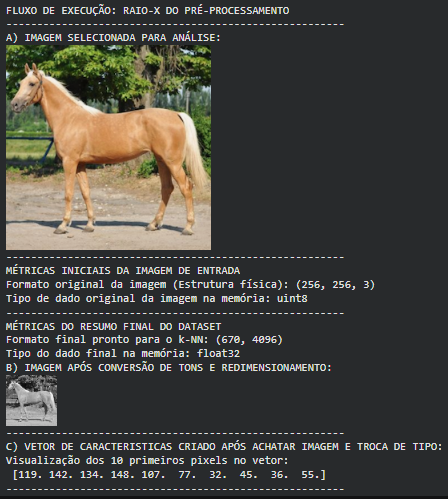
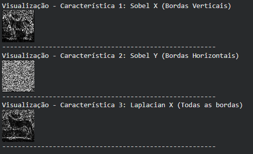

# MLP & CNN 
* **Single Neuron (Rede Neural de 1 Neurônio):** Foco no funcionamento básico — Pesos ($W$), Viés ($b$), Função de Soma e Ativação. É a base de tudo.
* **Multilayer Perceptron (MLP):** Quando empilhamos vários neurônios em camadas "Dense" (Densas). Aqui, a rede já é considerada "Deep Learning", mas ainda é "cega" para estruturas espaciais, pois precisa que a imagem seja achatada (`Flatten`) em uma única dimensão de números.

### Por que usar CNNs em vez de MLP?
* **MLP (Pasta 01):** Analisa pixels isolados. Se a orelha de um cavalo mudar de posição na foto, a MLP pode não reconhecer que ainda é uma orelha, pois observa apenas o "endereço" fixo do pixel.
* **CNN (Pasta 02):** Utiliza **Filtros (Convoluções)** que percorrem a imagem. Aprende a identificar características (bordas, curvas, texturas e formas) independentemente de onde estejam posicionadas na imagem. 

# 19/02
- Preparar dados (Rotulagem/Anotação) — ensinando o modelo onde estão os objetos.
- Criar uma base de dados organizada de imagens.
- Aprender a rotular manualmente.
- Exportar arquivo no formato COCO JSON.
- Validação das anotações (verificar se as caixas estão corretas nas imagens).
- Iniciando entendimento sobre a Arquitetura YOLOv8

# Entendendo conceitos:
### Detecção (Object Detection)
- Identifica a localização de vários objetos na imagem.
- Entrada: uma imagem.
- Saída: uma lista de objetos detectados dentro da imagem, com suas respectivas classes e bounding boxes.

### Classificação 
- Identifica classes na imagem, mas **não** a localização.
- Entrada: uma imagem.
- Saída: classe atribuída à imagem inteira.

### Segmentação
- Classifica cada pixel da imagem.
- Pode ser semântica (todas as instâncias da mesma classe juntas) ou por instância (cada objeto separado).

### Pose
- Estima a posição de pontos-chave (keypoints) de um objeto ou ser vivo.
- Saída: coordenadas dos pontos anatômicos relevantes.

### Predição
- Inferência realizada pelo modelo treinado.
- Entrada: novos dados que o modelo nao conhece.
- Saída: estimativa baseada no que foi aprendido durante o treinamento.

## Arquiterua YOLOv8 20/02
- Compreensão da base da arquitetura: imports, configurações, treinamento (.train()), validação (.val()) e inferência (.predict()).
https://docs.ultralytics.com/models/yolov8/#segmentation-coco
### Escolha da Técnica e Modelos
- Detection: yolov8n.pt
- Instance Segmentation: yolov8n-seg.pt
- Pose/Keypoints: yolov8n-pose.pt
- Oriented Detection: yolov8n-obb.pt
- Classification: yolov8n-cls.pt
- Escalabilidade: Cada tamanho de modelo (n, s, m, l, x) possui um equilíbrio diferente entre performance (precisão) e consumo de hardware (velocidade/memória).
- Parâmetros:
    - Argumentos Básicos: São universais (ex: epochs, imgsz, batch).
    - Argumentos Específicos: Existem parâmetros que só fazem sentido para certas técnicas (ex: parâmetros de máscara ou pontos de articulação).
- Segmentação engloba a Detecção: Ao treinar um modelo de Segmentação (-seg.pt), o resultado sempre terá o atributo .boxes (a caixa) preenchido além do .masks (a máscara). A lógica da arquitetura segue esta ordem:
    - 1.Extração de Características: Identifica se "algo" existe na imagem.
    - 2.Detecção: Desenha um quadrado (Bounding Box) em volta desse "algo" para delimitar o espaço.
    - 3.Segmentação: Dentro do quadrado delimitado, a rede pinta pixel por pixel para encontrar o contorno exato.
- Para o YOLO fazer a máscara, ele obrigatoriamente precisa localizar o objeto primeiro. A Detecção é o "esqueleto" e a Segmentação é a "pele".

## Objetivo Validação:
- Verificar se o modelo aprendeu a generalizar ou se ele apenas decorou as imagens de treino (o que chamamos de Overfitting). Se a métrica no treino está ótima, mas na validação está péssima, modelo não serve para a vida real.
## Métricas de Performance
- As métricas são geradas após a etapa de Validação.

### A Matemática "Escondida"
- Toda a complexidade de Convoluções, Pooling, Backpropagation e funções de ativação está "encapsulada" dentro do código da Ultralytics. Ao dar o comando .train(), o YOLO ativa esse motor matemático.
- O Rótulo (Label): As imagens precisam estar rotuladas (anotadas) de acordo com a técnica.  O modelo não "adivinha" o que é segmentação sozinho. A técnica que foi escolhida no modelo (.pt vs -seg.pt) tem que dar "match" com o tipo de rótulo criado.
    - Para Detecção: Entrega para o modelo uma imagem e um arquivo de texto com 5 valores: classe x_centro y_centro largura altura. É a coordenada de um quadrado simples.
    - Para Segmentação: Entrega para o modelo a mesma imagem, mas o arquivo de texto contém dezenas de coordenadas: classe x1 y1 x2 y2 x3 y3... que formam o polígono (contorno exato).
    -  Para Pose: O arquivo de texto é mais denso. Ele combina a caixa da detecção com os pontos específicos (articulações): classe x y w h x1 y1 v1 x2 y2 v2.
- erro: Se carregar um modelo de segmentação (-seg.pt), mas entregar rótulos que só têm caixas (detecção), o modelo vai dar erro ou não vai aprender a segmentar, porque ele "esperava" polígonos e recebeu apenas quadrados.

## Notação de Imagens 24 e 25/02
### Softwares de Rastreamento (Sistemas Optoeletrônicos)
- São sensores de contraste que necessitam de pontos físicos (marcadores retroreflexivos ou ativos) no objeto. São ideais para ambientes controlados (laboratórios), mas limitados em campo.

### CVAT (Computer Vision Annotation Tool)
- Ferramenta de anotação de imagens com interface intuitiva, possibilitando trabalhar com anotações de keypoints (pontos-chave anatômicos) e também esqueletos. Permite exportar arquivos em vários formatos e utiliza IA genérica para interpolação (técnica matemática de preenchimento de dados entre dois pontos conhecidos) em vídeos através de tracks (rastreamento dinâmico baseado em fluxo óptico ou algoritmos de detecção).

### DeepLabCut (DLC)
- Framework especializado em aprendizado supervisionado (método de treinamento onde a IA aprende a partir de exemplos rotulados por um humano), baseado em Deep Learning (aprendizado profundo baseado em redes neurais artificiais complexas), que carrega diversas arquiteturas para treinar modelos.

## Camada 1 - Treinamento, validação e predição com DeepLabCut 04/03
- Entendendo o ciclo de vida do treinamento de uma rede neural (ResNet-50), a avaliação e a predição no restante do vídeo, com base em anotações manuais de 60 frames feitas na interface gráfica (Napari).

### Processo:
- Testando, estudando e analisando valores de épocas, cálculos e métricas, com valores de iterações diferentes.
- Entendendo métricas, possíveis erros e suas causas.

### Conceitos métricas
- **Train Loss:** - Erro dentro da imagem de treino. Quanto mais próximo de 0, melhor.
- **Valid Loss:** - Erro em uma pequena amostra de validação. Quanto mais próximo de 0, melhor.
- **Test RMSE:** - Distância média em pixels entre a anotação real e onde a rede acha que o ponto está.
- **RMSE (p-cutoff 0.1):** - Erro médio considerando apenas pontos onde a rede tem confiança superior a 0.1 (yaml). Se > 10px, a rede ainda pode precisar de mais treino ou mais dados para atingir o nível de um especialista.
- **mAP** - Acurácia média. Indica a porcentagem de acertos da rede com alta precisão.
- **maR** - Capacidade da rede de "encontrar" todos os pontos anotados.
### Métricas de Validação (Generalização)
- **Train RMSE:** - O que o modelo decorou (erro nas imagens que foram usadas para ajustar os pesos).
- **Test RMSE:** - O que o modelo aprendeu (erro em imagens que a rede nunca viu, indicando a capacidade de generalização).

## Teste 1: Desenvolvimento de Modelo Próprio (Customizado) Resnet50
* **O que é:** Treinamento via Transfer Learning (ResNet-50) no DeepLabCut com anotação manual de ~300 frames.
* **Objetivo:** Criar um modelo próprio para automatizar a rotulagem do dataset da Iniciação Científica.
* **Observações Pessoais:** O modelo aprendeu bem posições estáticas, mas falha na continuidade (interpolação). Notei que a falta de "pontos vizinhos" confunde a rede, fazendo-a trocar as patas dianteiras pelas traseiras, pois ela não tem contexto anatômico para entender onde cada membro deveria estar.

## Teste 2: Modelo Pré-treinado (Automatizado) HrnetW32
* **O que é:** Implementação de um modelo de benchmark (teste de comparação) para o Teste 1, previamente treinado em datasets massivos e especializados em morfologia equina, para execução de rotulagem automática.
* **Objetivo:** Comparar o desempenho de uma rede robusta com os resultados obtidos no Teste 1.
* **Observações Pessoais:** O modelo apresentou um resultado visual muito mais elegante e estável. Percebi que ele utiliza muito mais pontos de anotação e exibe um retângulo (Bounding Box) de detecção de objeto, o que parece limitar a área de aprendizado e facilitar a organização dos pontos no corpo do cavalo.

### Próximos Passos:
Ao analisar os dois testes (1 e 2), os seguintes passos serão aplicados para alcançar o objetivo de desenvolver um modelo próprio para automatizar futuramente as anotações:

- **Refinar o Esqueleto:** Adicionar novos keypoints estratégicos (como tronco e articulações intermediárias) para criar uma conexão estrutural que sirva de guia lógico para a rede.
- **Aumentar Dataset de Oclusão:** Anotar mais imagens, especificamente frames onde há cruzamento de membros, para ensinar a rede a diferenciar as identidades das patas.
- **Integração de Detecção de Objeto (Detecção Baseada em Keypoints):** Implementar uma camada de detecção (Bounding Box) para isolar o animal e definir uma Região de Interesse (ROI). Isso permitirá que a rede de pose foque exclusivamente na anatomia do cavalo, reduzindo o campo de visão e minimizando erros de interpolação causados por ruídos do cenário.(Redução do espaço de busca e eliminação de ruído)

## Teste 3: Evolução do Dataset e Identificação de Problemas (Semana 23/03)
* **Expansão de Dados:** O dataset foi ampliado para 20 vídeos e ~550 frames, incluindo imagens externas para aumentar a diversidade.
* **Crise de Semântica e Rotulagem:** Identificou-se que a nomenclatura baseada na câmera ("interno/externo") era falha para a generalização do modelo quando o animal mudava de orientação.Também, a reestruturação do esqueleto incluiu pontos no eixo central (cernelha e garupa) para servirem como âncoras semânticas. Ao fornecer pontos centrais estáveis, os membros bilaterais (patas dianteiras e traseiras) ganham um contexto espacial mais rígido, reduzindo erros onde o modelo "perde" a pata no espaço por falta de um referencial próximo.
* **Incidente Técnico:** Devido a uma falha na execução de um script de manipulação de coordenadas via CLI, houve a sobrescrita acidental de todos os pontos anotados para valor `null`. 
    * **Impacto:** Perda de aproximadamente 5 dias de trabalho manual.
    * **Lição Aprendida:** Necessidade de versionamento de dados e backups antes de scripts automatizados.

## Reestruturação e Otimização do Workflow (Semana 30/03)
* **Implementação de Pipeline de Detecção:** Introdução do YOLOv8 para detecção de cavalos antes da anotação de pontos.
* **Estratégia de Crop:** Os frames originais foram cortados com base nas caixas delimitadoras (bounding boxes), focando apenas no animal.
    * **Ganho de Eficiência:** Redução de 50% no tempo de anotação por frame (média de 15 min).
* **Nova Convenção de Keypoints:** Migração para nomes semanticamente consistentes (Lado Direito vs. Lado Esquerdo), tornando o modelo imune à orientação da câmera.
* **Refinamento do Esqueleto:** Adição de pontos no eixo central (dorso/cernelha/garupa) para servir de "âncora" aos membros bilaterais, melhorando a estrutura vizinha para o treinamento.

## Metodologia de Anotação e Tratamento de Oclusão
### Para reduzir erros de interpolação e melhorar métricas de precisão, foram definidas regras estritas:
* **Detecção (YOLO)** - Localização Global - Definir a área de busca do animal na cena original. 
* **Crop (Recorte)** - Zoom Especialista - Eliminar ruídos visuais e focar nos detalhes anatômicos. 

### Foi aplicado regras distintas para diferentes tipos de invisibilidade do ponto:
* **Oclusão por Objeto (ex: Grama):** Considerada "Extensão Lógica". O ponto **é anotado** para manter a continuidade do movimento e consistência em cálculos de velocidade/marcha.
* **Auto-Oclusão (Corpo do animal):** Considerada "Perda de Sinal". O ponto **não é anotado** para evitar que a rede alucine coordenadas ou confunda membros (pata direita vs. esquerda).

# Relatório  de Refinamento e Backup (09/04)
## Dificuldades Detectadas na Anotação 
Durante o processo de anotação dos frames, foram identificados fatores críticos que desafiam a precisão do modelo e a consistência dos dados:
* **Interferências Ambientais:** Efeito de areia sendo chutada pelo animal, o que oclui os membros inferiores.
* **Contraste e Camuflagem:** A cor do animal em relação ao fundo e variações na pelagem dificultam a distinção exata das bordas.
* **Oclusões Externas:** Outros animais passando por trás e presença de seres humanos (membros) na frente de partes vitais para a biomecânica, como a cernelha e o dorso.
* **Qualidade da Imagem:** Ocorrência de erros de pixel no frame (artefatos digitais).
* **Variabilidade Morfológica:** Mudanças bruscas de posição do cavalo conforme o movimento e a presença de animais machucados no dataset (o que altera a angulação natural das articulações).

## Metodologia de Refinamento e Precisão
A precisão em nível de pixel é fundamental, pois pequenas variações de coordenadas podem gerar ruídos significativos nos cálculos biomecânicos.

* **Identificação de Marcos Anatômicos:** Para garantir a consistência entre frames, utilizei músculos, manchas, juntas e articulações como guias visuais para aplicar os pontos sempre no mesmo local relativo.
* **Processo de Revisão Iterativa (Refatoração de Pontos):**
    * A anotação inicial de 17 pontos por frame é exaustiva, o que pode levar à perda de microdetalhes devido à carga cognitiva.
    * Ao realizar uma segunda passagem para análise, o foco muda para o ajuste fino. Notei a necessidade de ajustar cerca de 3 a 4 pontos por frame.
    * Esses ajustes de "milicentímetros" nas coordenadas são cruciais, pois poucos pixels de diferença já impactam a qualidade do contexto aprendido pelo modelo.
* **Objetivo:** Garantir que o contexto de localização seja o mais idêntico possível em todos os ~550 frames.

## Organização do Dataset e Backup
Para garantir a segurança dos dados após o incidente anterior, foi estruturada uma pasta de backup no Drive com a seguinte composição:

* **Conteúdo do Backup:**
    * Anotações refatoradas dos 20 vídeos originais (foco em cavalos indo para o lado esquerdo).
    * 18 imagens aleatórias (dataset externo).
    * 10 imagens espelhadas/invertidas extraídas dos vídeos (cavalos indo para o lado direito), visando aumentar a robustez do modelo para lateralidade.

# Projeto de Iniciação Científica - Fase 2
### Estudo de Domínios e Aprendizado de Máquina
Nesta fase, o foco está na compreensão de **domínios (origem e destino)**, **conflito de domínio**, **adaptação de domínio** e **aprendizado por transferência (Transfer Learning)**.

### Conceitos Aplicados
* **Transfer Learning (Aprendizado por Transferência):**
    * **Onde acontece:** Na transição do modelo geral para o modelo especialista.
    * **Aplicação:** Utiliza o conhecimento prévio do modelo (que já aprendeu a identificar formas de quadrúpedes no dataset *SuperAnimal*) e direciona esse aprendizado especificamente para a anatomia e biomecânica dos cavalos. É o ato de aproveitar os pesos já treinados da rede neural para refinar a detecção em uma espécie-alvo.

* **Adaptação de Domínio:**
    * **Onde acontece:** Na resolução do conflito entre o ambiente de treino e o cenário real de aplicação.
    * **Aplicação:** Realizada ao adicionar fotos de humanos ao treinamento para classificá-los como falso positivo. Isso ajusta o modelo para que ele "entenda" que o domínio de aplicação (mundo real) contém elementos de distração (humanos) que não eram o foco do domínio original. Força o modelo a aprender a fronteira entre o que é o animal e o que é o ambiente/ser humano

## Organização do Dataset
Iniciei a fase dois com a organização do dataset em cinco categorias estruturadas:
* **Pastas:** A, B, C, D e E.
* **Objetivo:** Cada pasta contém dados com características específicas (detalhadas no documento de estudo) para testar a eficácia de modelos de estimativa de pose animal já treinados sobre diferentes conjuntos de dados.

#### Testes e Inferência
O primeiro modelo testado foi o **SuperAnimal-Quadruped**, um modelo conhecido como *"Plug-and-Play"* (Zero-shot), que possibilita a identificação de animais sem necessidade de anotações prévias.

1.  **Inferência:** Realizei a inferência dos meus dados neste modelo para avaliar a capacidade de **generalização** da rede ao lidar com imagens inéditas.
2.  **Variáveis de Teste:** Os vídeos utilizados apresentam variações significativas em:
    * Cenários e contextos distintos;
    * Orientação do animal em relação à câmera;
    * Interação humano-animal (pessoas montadas ou caminhando junto ao cavalo).

# Diagnóstico de Problemas e Insight: Validação Geométrica (Humano vs. Cavalo)

O modelo atual, embora eficiente na generalização de pontos para diversos animais, apresenta falhas críticas de detecção na presença de seres humanos. 

### Problema Detectado
O erro principal ocorre quando o modelo identifica um humano como se fosse um segundo animal na cena, gerando um **falso positivo**. Isso acontece porque o modelo é multimodal e tenta encontrar padrões de articulações em qualquer corpo em movimento, falhando em distinguir a espécie em cenários de proximidade.

### O Insight: Predominância Dimensional
Ao analisar esses erros de predição, cheguei a uma percepção baseada na anatomia estrutural do esqueleto e como ela se projeta no plano:

*   **Análise Visual:** O cavalo apresenta uma distribuição de pontos predominantemente **horizontal** (eixo X predominante entre cabeça e cauda). Já o ser humano apresenta uma distribuição **vertical** (eixo Y predominante entre cabeça e pés).
*   **A Solução Proposta:** Em vez de retreinar o modelo ou carregar uma segunda rede neural pesada para identificar o humano, a ideia é utilizar algoritmos de geometria como um **"filtro de postura"**.

### Lógica de Execução
Se o modelo identificar um objeto como cavalo, mas a "vizinhança" dos pontos ou a proporção entre os eixos X e Y indicar uma estrutura verticalizada, o sistema descarta a predição instantaneamente. 

Por ser um cálculo matemático leve, essa abordagem evita a necessidade de "reinventar a roda" com modelos multimodais caros e foca diretamente na **sustentabilidade computacional**, reduzindo drasticamente o processamento necessário para manter a precisão da solução.

# Estudo: Paradigmas de Aprendizagem e Diagnóstico de Predição

Durante os estudos de hoje, cataloguei os principais algoritmos de Machine Learning. O foco é priorizar algoritmos baseados em **Modelo** para a execução final, devido à leveza e velocidade de predição.

# Pensamento Estratégico: O PCA como Filtro de Eficiência

Ao aprofundar os estudos sobre o **PCA** (Análise de Componentes Principais), percebi que sua utilidade no projeto vai além da simples redução de dados; ele funcionará como um **curador matemático** de relevância biomecânica.

### A Percepção do Excesso
Analisando as predições geradas pelo modelo pronto, notei que ele entrega uma densidade de pontos que muitas vezes ultrapassa a necessidade real para a identificação da marcha. Pontos que não variam ou que se movem de forma perfeitamente síncrona com outros são redundantes.

### A Estratégia do Filtro
Poderia aplicar o PCA como um filtro de pós-processamento, para:
1.  **Isolamento da Variância:** O PCA vai identificar quais eixos de movimento realmente carregam a "assinatura" do trote do cavalo.
2.  **Descarte de Ruído:** Pontos estáticos ou com variação insignificante serão comprimidos. Isso limpa a estrutura esquelética antes que ela chegue na camada de decisão.
3.  **Economia Computacional:** Ao reduzir a dimensionalidade dos dados logo na saída do modelo de visão, eu diminuo drasticamente o custo de memória e processamento para as etapas seguintes.

Objetivo é entender sobre a aplicação prática do conceito de **Green AI**: ser inteligente na escolha dos dados para ser econômico no consumo de energia. Não preciso de 50 pontos se 12 componentes principais explicam 95% da biomecânica que eu preciso analisar.

# Diagnóstico de Performance: Falsos Positivos

Ao testar as predições do modelo multimodal, identifiquei que o principal gargalo técnico é a ocorrência de **Falsos Positivos**. 

*   **O que está acontecendo:** O modelo "enxerga" um cavalo onde, na verdade, existe um ser humano. No contexto de Machine Learning, isso significa que o modelo está classificando incorretamente a classe negativa (humano) como positiva (cavalo).
*   **Impacto:** Isso gera ruído nos dados biomecânicos, pois o sistema tenta calcular angulações equinas em uma estrutura humana.

# Ferramenta de Análise: Matriz de Confusão

Para quantificar esses erros e avaliar a eficácia do meu "Filtro Geométrico", comecei a estudar a **Matriz de Confusão**. Ela será essencial para medir o sucesso da solução proposta.

### Entendimento Inicial:
A matriz me permite visualizar quatro cenários principais:
1.  **Verdadeiro Positivo (VP):** O modelo diz que é cavalo e realmente é. (O que buscamos).
2.  **Verdadeiro Negativo (VN):** O modelo ignora o humano corretamente. (O que o filtro geométrico deve garantir).
3.  **Falso Positivo (FP):** O modelo diz que é cavalo, mas é humano. (**Meu problema atual**).
4.  **Falso Negativo (FN):** O modelo não identifica o cavalo que está na cena.

### Conclusão de Estudo
O objetivo do meu insight sobre **Predominância Dimensional** é atacar diretamente a taxa de **Falsos Positivos**. Ao aplicar a regra geométrica (Vertical vs. Horizontal), espero "limpar" a Matriz de Confusão, movendo os erros de Falso Positivo para a coluna de Verdadeiros Negativos, garantindo que o sistema seja robusto sem precisar ser **computacionalmente caro**.

## Conectando Conceitos: Coerência Espacial e Orientação através do PCA
###  Enquanto a Coerência Espacial olha para "dentro" (se os pontos estão no lugar certo entre si), a orientação olha para "fora" (como a estrutura inteira está girada ou posicionada no espaço/tela).

Estudando, percebi que o PCA não é apenas um "compactador", mas uma ferramenta de análise geométrica que valida a **Coerência Espacial** e a **Orientação** dos dados através da análise da nuvem de pontos.

**Conclusão:** Usar o PCA como filtro é, na prática, aplicar um teste estatístico de coerência e orientação antes de gastar processamento com a análise biomecânica detalhada. É a inteligência da variância garantindo que eu só processe o que realmente tem "formato e postura" de cavalo.

# Resumo estrátegia pesquisa: Visão Computacional Sustentável
* **Foco Central:** Migrar o peso da solução da Inteligência Artificial (probabilística/pesada) para a Geometria e Matemática (determinística/leve).

* **Filosofia "Green AI":** Desenvolver algoritmos que priorizem o baixo consumo de carbono e a economia de recursos computacionais através de lógica direta e contexto espacial.

* **Ética e Acessibilidade:** Defender a "Democratização da Computação", criando soluções que funcionem em máquinas comuns, permitindo que mais pesquisadores contribuam para a ciência sem depender de hardware caro.

* **Objetivo Prático:** Utilizar a Visão Computacional para resolver problemas de biomecânica (humana e equina) através de regras geométricas, minimizando a necessidade de treinamentos exaustivos e inferências custosas de modelos de Deep Learning.

# Estudando Conversão de Imagens em Matriz de Pixels - OpenCV:
- Utilizando dataset do Kaggle para desenvolver um classificador de cavalos.
- Estudando a utilização do OpenCV para trabalhar com imagens.
- Foco em Machine Learning Clássico (aprendizado supervisionado): classificação e regressão.

# O Algoritmo k-NN (k-Nearest Neighbors)

O k-NN é um algoritmo de **Aprendizado Supervisionado** utilizado para resolver problemas de classificação (como determinar se uma imagem contém um "Cavalo" ou "Não é Cavalo"). Trata-se de um conceito matemático e estatístico baseado no cálculo da distância geométrica entre pontos (como a Distância Euclidiana). O OpenCV disponibiliza essas funções prontas e otimizadas, dispensando a necessidade de implementar os cálculos do zero.

Esse algoritmo não interpreta imagens coloridas diretamente a partir da matriz de pixels de forma eficiente. Se uma matriz de pixels pura for enviada ao k-NN, ele comparará apenas se os pixels na mesma posição possuem cores semelhantes. Caso o objeto mude de posição ou direção entre as fotos, o algoritmo não o reconhecerá de forma adequada. Por esse motivo, as etapas de **pré-processamento** e **extração de características** são fundamentais.

# Pré-processamento (Limpeza e Padronização)
Esta etapa é obrigatória porque o algoritmo k-NN exige dados de tamanhos e formatos idênticos. O objetivo é homogeneizar os dados brutos antes de qualquer análise através de três passos principais:

### 1. Conversão para Tons de Cinza
Reduz a complexidade dos dados ao transformar a estrutura original de três canais de cor para apenas um canal de intensidade. Isso elimina informações irrelevantes para o algoritmo, como a cor do fundo ou da pelagem.
* **Entendimento da Estrutura Física:** No processamento padrão, o número de canais indica a intensidade da cor. No OpenCV, a estrutura representa dimensões na memória. Um formato `(256, 256, 3)` indica que o computador armazena 3 matrizes completas sobrepostas (uma para cada canal de cor), onde cada linha e coluna representa a posição geométrica do pixel na tela, e não o valor isolado da cor.

### 2. Redimensionamento da Imagem (*Resize*)
Garante que todas as imagens possuam o mesmo número de pixels (altura e largura), gerando matrizes de dimensões iguais para viabilizar o cálculo matemático de distância.
* **Cálculo da Matriz:** Ao reduzir uma imagem para o tamanho padrão de `(64, 64)`, multiplica-se a quantidade de linhas (64) pelas colunas (64). O resultado determina que a imagem menor passa a conter um total de 4.096 pixels. Ela ainda permanece como uma matriz bidimensional (com duas dimensões: altura e largura), representando a quantidade total de elementos dentro do espaço quadrado.

### 3. Transformação de Matriz para Vetor (*Achatamento e Tipo*)
O módulo de Machine Learning do OpenCV exige que as imagens sejam enviadas em um formato estruturado específico através de duas ações:
* **O Achatamento (*Flatten*):** Transforma a matriz bidimensional em um vetor unidimensional (uma linha reta de dados). A imagem deixa de ser um quadrado e vira uma fila indiana de números. A representação do formato com uma vírgula isolada — como `(4096,)` — indica que o conceito de linhas e colunas foi eliminado. 
* **Mudança de Tipo de Dado (*Cast*):** Converte os valores da memória para o tipo numérico de ponto flutuante `float32`, que é o formato exigido pelo k-NN para realizar os cálculos.

# Extração de Características (*Feature Extraction*)
Após os dados estarem limpos e padronizados, inicia-se a geração de informações novas para o modelo, evitando o envio de pixels brutos que possam confundir o classificador.

* **Objetivo:** Aplicar funções matemáticas para escanear a imagem limpa e extrair apenas os pontos marcantes, formas estruturais ou texturas (características reais).
* **Propriedades Visuais Isoladas:**
  * **Bordas e Contornos:** Filtros que mapeiam o início e o fim das linhas do objeto para identificar silhuetas.
  * **Texturas e Gradientes:** Algoritmos que identificam padrões repetitivos ou direções de sombras.
* **O Vetor de Características (*Feature Vector*):** O OpenCV converte as propriedades extraídas em um vetor numérico simplificado que descreve apenas esses formatos e gradientes. Na estrutura do k-NN, mesmo quando o processo utiliza os pixels brutos organizados em linha reta através do achatamento, o resultado recebe matematicamente o nome de vetor de características, onde cada pixel isolado passa a ser tratado como uma característica numérica independente.

# Estruturação e Organização dos Dados na Memória
O maior desafio conceitual está em compreender a transição entre enxergar uma imagem visual e entender como o computador a organiza internamente como uma tabela de números:

1. **Vetor Individual:** Cada imagem processada individualmente no laço de repetição gera um vetor unidimensional próprio de características.
2. **Armazenamento em Lista:** Uma lista nativa do Python atua como uma sacola de armazenamento temporário, agrupando cada um dos 670 vetores individuais gerados durante a execução do fluxo.
3. **Unificação com NumPy:** A conversão final transforma essa lista nativa em uma estrutura de matriz unificada (`np.array`). Esse processo empilha os 670 vetores de forma organizada, gerando uma única grande tabela estruturada com o formato final de `(670, 4096)` (670 imagens por 4096 pixels), deixando o dataset totalmente pronto para ser enviado à função de treinamento do k-NN.

# Extração de Características - Filtros de Bordas e Gradientes
Na etapa de extração de características, decidi seguir uma estratégia de **filtros independentes** em vez de extratores complexos prontos. Apliquei diferentes transformações matemáticas sobre a minha imagem pré-processada em tons de cinza. Cada um desses filtros gera uma matriz nova do mesmo tamanho da imagem de entrada ($64 \times 64$), ressaltando uma informação visual específica e isolada (como bordas verticais, horizontais e relevos).
Utilizando as funções `cv.Sobel()` e `cv.Laplacian()`, consegui extrair minhas **3 primeiras características independentes** a partir da mesma imagem de entrada.

### Filtros Utilizados e Suas Propriedades
O OpenCV trabalha com a variação de intensidade dos pixels (gradientes). Uma transição de **preto para branco** gera um valor positivo, enquanto a transição de **branco para preto** gera um valor negativo. Para não perder as bordas negativas (que seriam zeradas se eu usasse o tipo padrão `uint8`), apliquei os filtros utilizando a alta precisão do tipo `cv.CV_64F`, extraí o valor absoluto com o `np.absolute()` e depois preparei o dado para o k-NN.

* **SOBEL X (Gradiente Horizontal):** O filtro caminha horizontalmente e detecta variações bruscas de cor nas laterais. Ele destaca **bordas verticais** da imagem (excelente para capturar a estrutura das pernas do cavalo).
* **SOBEL Y (Gradiente Vertical):** O filtro caminha verticalmente (de cima para baixo). Ele destaca **bordas horizontais** da imagem (excelente para capturar a linha do dorso do cavalo ou a divisão do chão).
* **LAPLACIANO (Gradiente de Segunda Ordem):** Calcula a soma das segundas derivadas espaciais. Ele encontra **todas as bordas e contornos de uma só vez**, independente da direção, mapeando o relevo geral das formas.

### Ajuste de Hiperparâmetros dos Filtros
O comportamento dessas funções matemáticas pode ser tunado e modificado através de parâmetros específicos que alteram o que o k-NN vai "enxergar":
* **Tamanho do Kernel (`ksize`):** É a matriz de varredura (ex: $3 \times 3$, $5 \times 5$). Kernels menores são altamente sensíveis a texturas e ruídos; kernels maiores ignoram detalhes e focam na silhueta grossa.
* **Ordem da Derivada (`xorder` e `yorder`):** Define a direção do cálculo no Sobel (como `1, 0` para X ou `0, 1` para Y). É possível aumentar para a segunda ordem (`2, 0` ou `0, 2`) para obter linhas mais finas.
* **Filtro Scharr:** Ativado ao configurar `ksize = -1` no Sobel, utilizando um kernel $3 \times 3$ otimizado que entrega maior precisão matemática na busca pelos gradientes.